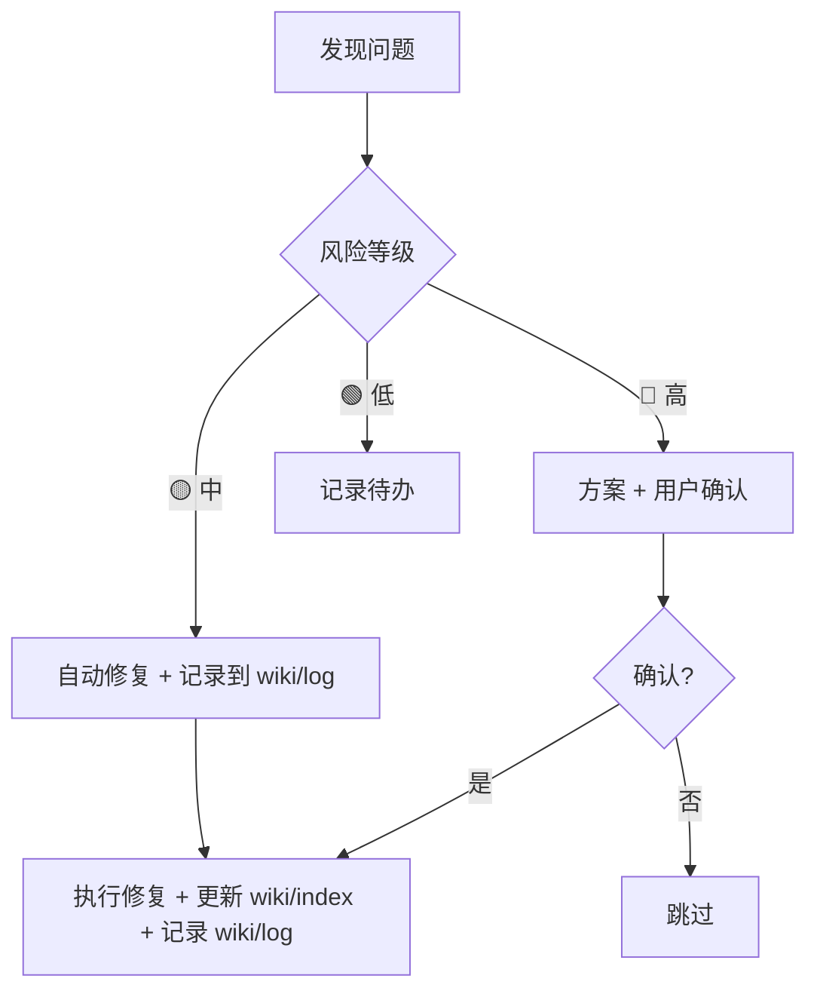

# Lint & Enhance: 健康检查与增强维护

> 目录：[目标](#目标) → [两大模式](#两大模式) → [Lint 检查项](#lint-检查项) → [报告格式](#报告格式) → [增强操作](#增强操作) → [执行与风险分级](#执行与风险分级) → [🔒 检查清单](#-lint-检查清单)

## 目标

让 LLM 定期扫描 Wiki 质量，主动发现并修复问题——矛盾、孤岛、过期、缺口。Karpathy 称之为 **Lint**，很贴切：像代码 linter 一样自动检查知识库的健康度。

## 两大模式

### A. Lint（健康检查）

定期扫描，输出结构化报告。

- 通过 provider 的 `healthcheck` 接口执行自动化检查
- 通过 `wiki_list` + `wiki_read` 逐页扫描内容质量
- local 后端可额外使用 `providers/local/healthcheck.py` 辅助脚本

### B. Enhance（主动增强）

基于 Lint 结果和日常操作中的发现，主动改进 Wiki。

---

## Lint 检查项

> 以下检查项适用于所有 provider。具体实现方式由各 provider 的 `healthcheck` 接口决定。

### 1. 一致性 (Consistency)
- [ ] 同一概念在不同页面定义是否一致？
- [ ] 同一事实在不同摘要中数据是否一致？
- [ ] 术语使用是否统一（无同义词混用）？

### 2. 完整性 (Completeness)
- [ ] "待补充"标记超过 7 天未处理？
- [ ] 悬空链接（引用了但尚未创建的页面）？
- [ ] `wiki/index` 条目与实际知识页一一对应？
- [ ] 每条 raw 素材都有对应 summary？

### 3. 结构完整性 (Structure)
- [ ] 孤岛页面（无其他页面链接过来）？
- [ ] 过大页面（建议 < 200 行）？
- [ ] 反向链接准确？
- [ ] 目录层级合理（≤ 4 层）？

### 4. 新鲜度 (Freshness)
- [ ] 最近 30 天有新素材入库？
- [ ] 摘要反映最新信息？
- [ ] `wiki/log` 最近有操作记录？

### 5. 覆盖度 (Coverage)
- [ ] 核心主题覆盖均衡？
- [ ] 用户高频查询话题有足够支撑？
- [ ] 明显的知识空白区域？

## 报告格式

> **评分规则和扣分阈值由 `references/lint-rules.yaml` 统一定义（单一数据源）。** `providers/local/healthcheck.py` 从该文件读取规则驱动检查和计分。如需调整维度、阈值或扣分值，只需修改 `lint-rules.yaml`。

### 评分维度

五个维度，每个初始 5 分，最低 1 分：一致性、完整性、结构、新鲜度、覆盖度。具体扣分项和阈值见 `references/lint-rules.yaml`。

评分渲染为 ⭐（实星 = 得分，☆ = 空星，共 5 格）。

### 报告结构

```markdown
# Wiki Lint 报告
- 时间: <date> · 页面总数: N · Raw 总数: M

## 基本信息
- Wiki 页面总数: N
- Raw 素材总数: M

## 评分
| 维度 | 评分 | 说明 |
|------|------|------|
| 一致性 | ⭐⭐⭐⭐☆ | <具体发现> |
| 完整性 | ⭐⭐⭐☆☆ | <具体发现> |
| 结构   | ⭐⭐⭐⭐⭐ | <具体发现> |
| 新鲜度 | ⭐⭐⭐☆☆ | <具体发现> |
| 覆盖度 | ⭐⭐⭐⭐☆ | <具体发现> |

## 问题汇总
- 🔴 严重: N
- 🟡 警告: N
- 🟢 良好: <无问题的维度或发现>
```

## 增强操作

| 操作 | 触发时机 | 说明 |
|------|---------|------|
| 矛盾标记/解决 | Lint 后 / Compile 时 | 不同页面冲突表述，并列或标注 |
| 缺失补全 | Lint 后 | 概念只有提及没有展开 → 通过 `wiki_write` 创建页面 |
| 外部补充建议 | Query 发现空白 | 建议用户补充某方向素材 |
| 关联发现 | Compile 新素材时 | 发现文档间未被记录的联系 → 更新 `wiki/links/relations` |
| 研究问题生成 | 用户要求 | 基于知识库提出开放性问题 |

## 执行与风险分级



**触发方式**：手动（"跑个 lint"、"health check"）或定期 cron（每周，仅有问题时通知）。

## 与心跳的集成

- 心跳时轻量检查（新鲜度 + 明显错误）
- 深度 Lint 单独触发或定期 cron
- 结果通过 `wiki_write` 写入 `wiki/log`

## 🔒 Lint 检查清单

- [ ] 已通过 provider 的 `healthcheck` 接口或 `wiki_list` + `wiki_read` 扫描完成健康报告
- [ ] 报告已交付用户
